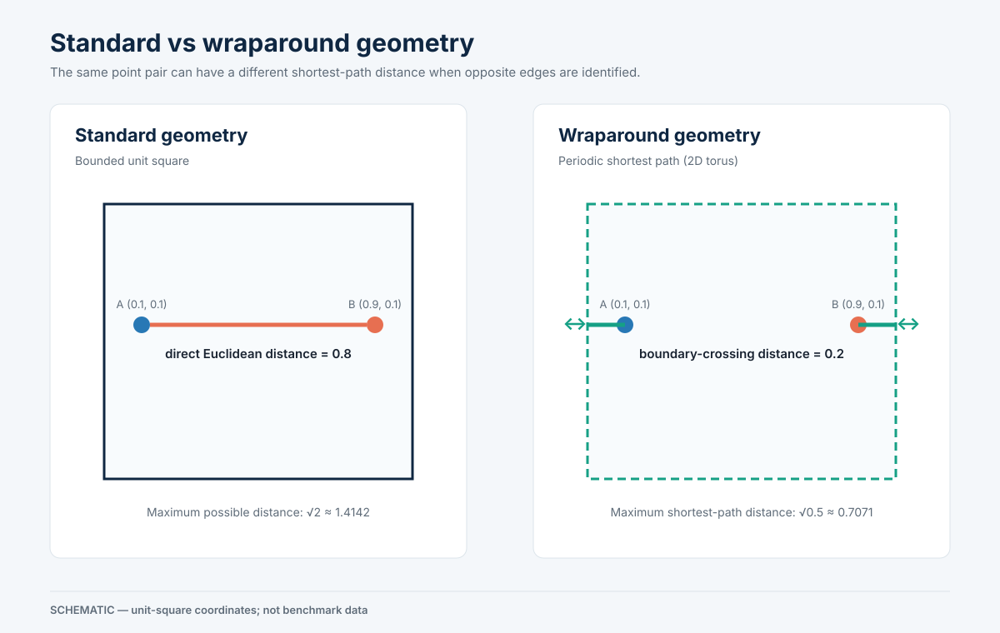
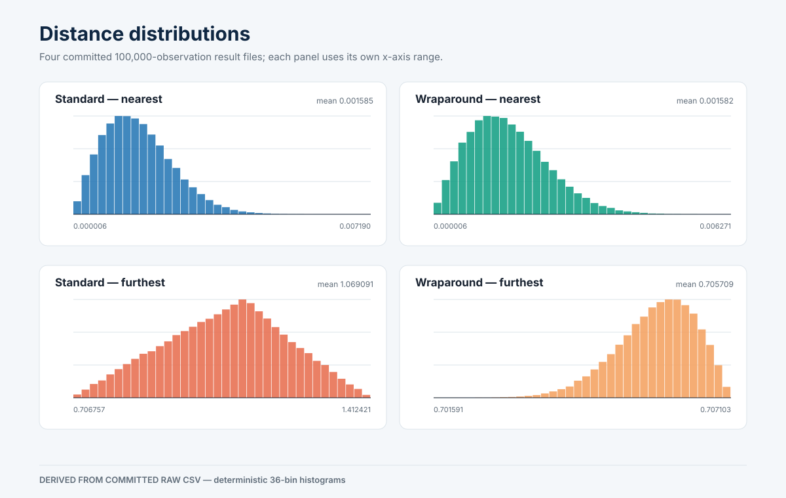
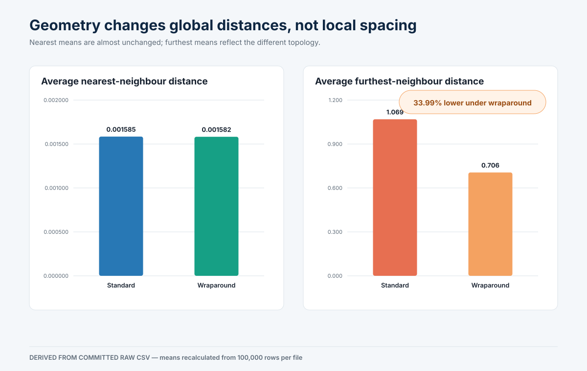
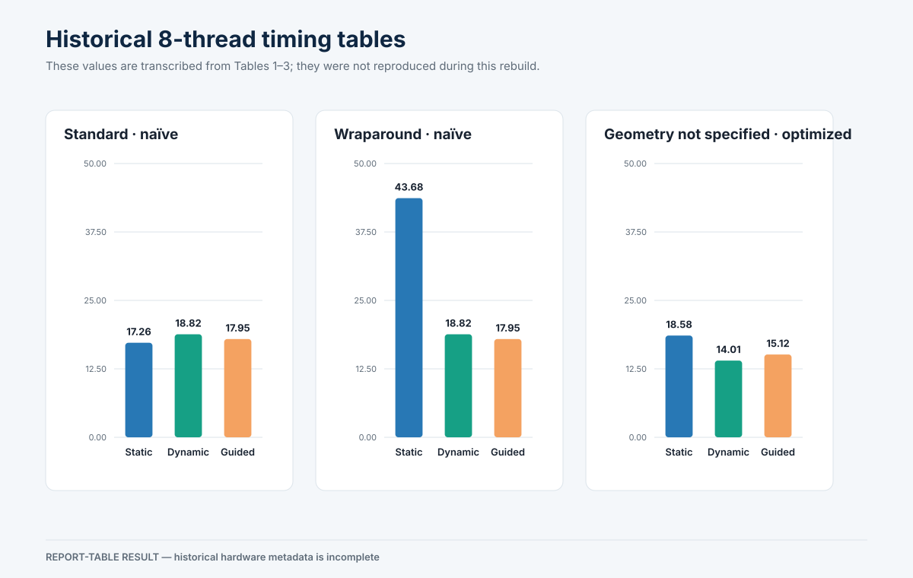
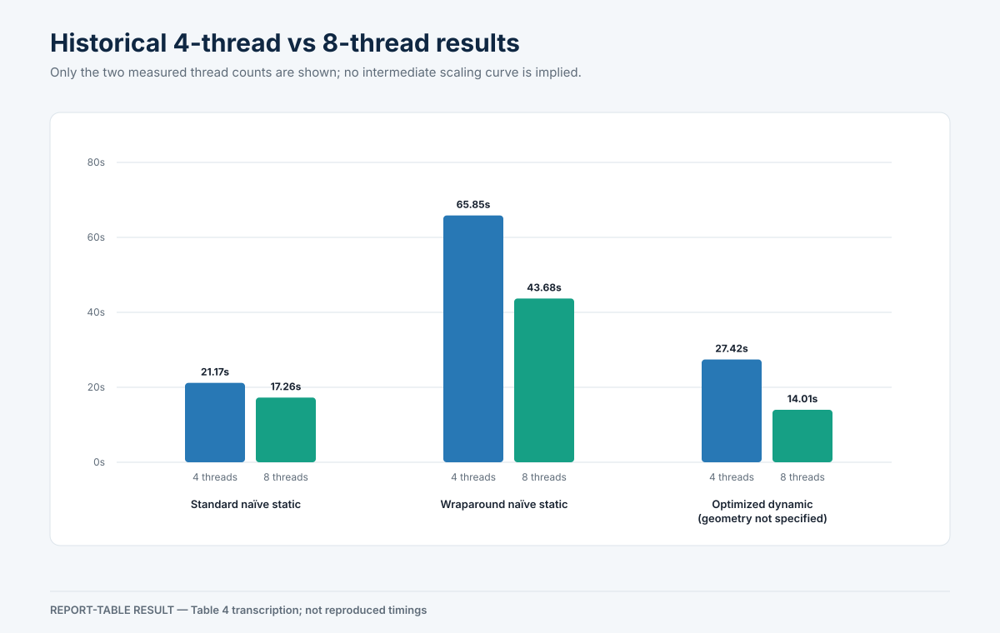

# Parallel Pairwise Distance Analysis with OpenMP

An OpenMP C++ study of **O(N²) nearest/furthest-neighbour computation, periodic geometry, symmetry-based optimization, and scheduling trade-offs**.

This is a geometric pairwise-distance experiment, not a gravitational N-body dynamics simulator. It intentionally retains the all-pairs problem so the effects of symmetry, OpenMP scheduling, load balance, and thread-local storage remain visible.



## Project at a glance

| | |
|---|---|
| Language | C++17 |
| Parallelism | OpenMP shared-memory parallelism |
| Problem | Nearest and furthest neighbour for every 2D point |
| Complexity | Naïve `N(N-1)`; symmetry version `N(N-1)/2` pair evaluations |
| Geometry | Euclidean unit square vs periodic 2D torus |
| Schedules | Static, Dynamic, Guided |
| Largest coursework dataset | `N = 100,000` |

## Key findings

- **Committed raw CSV:** wraparound topology changes the average nearest distance by only `0.135%`, while reducing average furthest distance by **`33.990%`**.
- **Committed raw CSV:** the standard furthest maximum is `1.412421`, close to the unit-square limit `√2`; the wraparound maximum is `0.707103`, close to the torus shortest-path limit `√(0.5²+0.5²) ≈ 0.707107`.
- **Report-table result:** Static was fastest for the standard naïve rectangular loop (`17.26 s` on the reported 8-thread experiment), where outer-loop work is approximately uniform.
- **Report-table result:** Dynamic was fastest in the formal optimized table (`14.01 s`) and the optimized Dynamic configuration has a reported `1.96×` 4-to-8-thread speedup. These historical timings were **not reproduced** during this rebuild.

## Standard vs wraparound geometry

For points `p=(x₁,y₁)` and `q=(x₂,y₂)`, standard geometry uses ordinary Euclidean distance. Periodic geometry uses the shorter displacement independently on each axis:

```text
dx = min(|x₁-x₂|, 1-|x₁-x₂|)
dy = min(|y₁-y₂|, 1-|y₁-y₂|)
d  = sqrt(dx² + dy²)
```

For `(0.1,0.1)` and `(0.9,0.1)`, standard distance is `0.8`; wraparound distance is `0.2`. Connecting opposite edges removes boundary effects for shortest-path distance. Local nearest-neighbour spacing stays similar, while the maximum possible shortest path falls from `√2` to `√0.5`.

## Naïve vs symmetry-optimized algorithm

The naïve method compares every `i` with every `j != i`, evaluating `N(N-1)` ordered pairs. Every outer iteration performs `N-1` comparisons, producing a rectangular, approximately uniform workload that maps naturally to `#pragma omp parallel for`. Static scheduling has low runtime scheduling overhead for this specific structure; it is not universally the best OpenMP schedule.

The optimized method uses `d(i,j)=d(j,i)` and computes only `j > i`, reducing distance evaluations to `N(N-1)/2`. That arithmetic saving changes the outer loop into a triangular workload:

```text
i = 0      → N-1 comparisons
i = 1      → N-2 comparisons
...
i = N-2    → 1 comparison
```

Static contiguous assignment can load early-index threads more heavily. Dynamic and Guided scheduling can redistribute iterations, but add scheduling overhead. Because each computed pair updates both `i` and `j`, the implementation stores per-thread minima/maxima and merges them after the pair loop. This avoids update races and atomics at the cost of approximately `2 × N × threads × sizeof(double)` storage, extra writes, and merge work.

Reducing arithmetic therefore does not guarantee a proportional runtime reduction: loop shape, scheduling, memory traffic, cache behavior, and merge cost all matter.

## Raw-data distance results

Each committed raw file contains exactly 100,000 valid observations with no missing or invalid values. Values below are regenerated by `scripts/analyze_distances.py`; standard deviation is the population statistic.

| Geometry | Measure | Mean | Minimum | Maximum | Population σ |
|---|---|---:|---:|---:|---:|
| Standard | Nearest | 0.001584506530 | 0.000006 | 0.007190 | 0.000831629510 |
| Wraparound | Nearest | 0.001582369510 | 0.000006 | 0.006271 | 0.000828306403 |
| Standard | Furthest | 1.069091173640 | 0.706757 | 1.412421 | 0.144315652554 |
| Wraparound | Furthest | 0.705709488330 | 0.701591 | 0.707103 | 0.000729421198 |





The furthest-distance reduction recalculated from the raw means is:

```text
(1.069091173640 - 0.705709488330) / 1.069091173640 × 100
= 33.989775079%
```

## Historical benchmark results

The original report’s formal timing tables are retained as historical evidence, not reproduced results. Hardware, compiler, affinity, and raw timing logs are incomplete.





The report is internally inconsistent: its wraparound table conflicts with adjacent prose, its optimized prose gives `21.96 s` and `16.65 s` where the table gives `18.58 s` and `14.01 s`, and its conclusion favors Guided although the formal optimized table favors Dynamic. A historical plotting script contains yet another timing revision. See [the benchmark audit](reports/benchmark-audit.md); no conflict is silently reconciled.

## Build and run

Requirements: CMake 3.20+, a C++17 compiler, and an OpenMP runtime.

```bash
cmake -S . -B build
cmake --build build
```

On AppleClang with Homebrew `libomp`, CMake may need its prefix explicitly:

```bash
cmake -S . -B build -DOpenMP_ROOT="$(brew --prefix libomp)"
cmake --build build
```

Generate a reproducible dataset and run one configuration:

```bash
./build/pairwise_distance_openmp \
  --generate 10000 \
  --seed 123 \
  --geometry standard \
  --algorithm naive \
  --schedule static \
  --threads 8
```

Read point coordinates from CSV (two columns, optional `x,y` header):

```bash
./build/pairwise_distance_openmp \
  --input data/points.csv \
  --geometry wraparound \
  --algorithm optimized \
  --schedule dynamic \
  --output-prefix results/local-wrap
```

Output files are written only when `--output-prefix` is explicit. CLI elapsed time is labeled `elapsed_seconds_local_run`; it is not automatically comparable to coursework timings from another machine.

## Validation and reproducible analysis

```bash
ctest --test-dir build --output-on-failure
python3 scripts/analyze_distances.py --check
python3 scripts/generate_assets.py --check
```

The C++ suite covers Euclidean and periodic distance, boundary crossing, corners/edges, duplicates, known small datasets, CSV parsing, invalid inputs, deterministic generation, and equality across all six algorithm/schedule combinations. CTest repeats the scientific checks with 1, 2, and 4 OpenMP threads; no test asserts wall time.

Regenerate derived artifacts after intentionally changing an input:

```bash
python3 scripts/analyze_distances.py
python3 scripts/generate_assets.py
```

The raw CSVs are primary evidence and should not be overwritten.

## Repository structure

```text
app/                         CLI
include/, src/               canonical C++ library
tests/                       deterministic correctness tests
scripts/                     CSV analysis and deterministic SVG generation
results/raw/                 original 100,000-row distance arrays
results/*.csv                derived statistics and report-table transcription
assets/                      reproducible portfolio figures
reports/                     audits, provenance, and original coursework PDF
archive/original-code/       preserved historical C++ variants
archive/historical-scripts/  preserved original plotting scripts
.github/workflows/ci.yml     GCC/OpenMP correctness CI
```

See [the source audit](reports/source-audit.md) for the role of every historical C++ file and [result provenance](reports/result-provenance.md) for the evidence chain.

## Limitations

- Pairwise computation remains `O(N²)` by design and does not scale to arbitrarily large `N`.
- Historical times are hardware-dependent, cover only limited thread counts, and contain unresolved inconsistencies.
- No hardware-counter profiling was recorded; explanations involving bandwidth, cache contention, or branch prediction are interpretations rather than direct measurements.
- Optimized thread-local storage grows approximately with `N × threads` for each of the minimum and maximum arrays.
- The coordinates used to produce the four committed raw distance arrays are not present, so those arrays cannot be regenerated exactly from point input.
- The simulation studies geometric nearest/furthest distance, not physical gravitational dynamics.

## Original coursework report

The original submitted PDF is preserved byte-for-byte at [`reports/original-report.pdf`](reports/original-report.pdf). Its scientific intent is summarized here in clearer technical language; uncertain and contradictory performance claims remain documented as uncertain.
